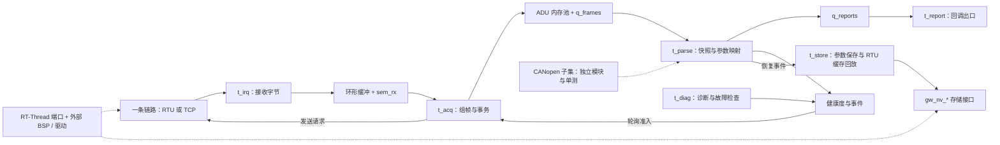

# RT-Thread 工业机器人通信网关

[](https://github.com/xiaoli5201314-spec/rt-thread-industrial-robot-gateway/actions/workflows/ci.yml)

**C99 网关核心、Modbus RTU/TCP 寄存器通信、CANopen 子集与 RT-Thread 端口适配。**

本项目围绕焊机、工业机器人和 PLC 的参数采集场景，组织了字节接收、协议组帧、事务重试、设备快照、参数上报、健康度管理与参数保存。仓库包含可在 Linux 主机执行的 pthread 端口、进程内模拟从站和单元测试，便于从源码审查嵌入式通信与并发设计。

**交付范围：网关软件核心、主机运行端口与 RT-Thread 适配接口。** 当前一个实例选择 RTU **或** TCP 模式；完整板级固件及真实设备验收仍需后续集成，详见文末工程边界。

**主机验证记录：** 2026-10-02，在 Ubuntu 22.04 / GCC 11.4 执行 `make -B test`，得到 117 个用例组、44095 条断言、0 失败，结果 PASS。运行于 `SCHED_OTHER(CFS)`，真实实时调度断言跳过，仅检查优先级继承机制。详见 [验证记录](docs/VERIFICATION.md)，此记录不等于板端或远端 CI 验收。

## 值得关注的技术点

| 技术点 | 可审查的实现证据 | 需要区分的边界 |
| --- | --- | --- |
| 通信任务拆分 | [gw_main.c](gateway/src/gw_main.c) 中接收、采集、解析、上报、诊断、存储六个线程及队列交接 | 配置中的优先级和栈大小是代码预算，不是已验证的实时性或板端高水位 |
| 协议层复用 | [modbus_pdu.c](gateway/src/modbus_pdu.c) 复用寄存器 PDU；RTU 增加 CRC，TCP 增加 MBAP 和流组装 | 只实现 `0x03/0x04/0x06/0x10`，不是完整 Modbus 功能集 |
| 字节流恢复 | [frame_sync.c](gateway/src/frame_sync.c) 的状态机、CRC 候选帧检查和重同步；TCP 半包/粘包组装 | RTU 不是完整的严格 T1.5 字符间隔实现 |
| 有界资源管理 | [ring_buffer.c](gateway/src/ring_buffer.c)、[mem_pool.c](gateway/src/mem_pool.c) 及 ADU 所有权交接 | 定长池不等于全工程无堆；释放的重复释放检查会遍历空闲链 |
| 故障策略 | [bus_health.c](gateway/src/bus_health.c) 分类计数、隔离、冷却探测、恢复阈值及环形事件日志 | 总线级 FAULT 的整机恢复探测闭环仍需补齐，DEGRADED 不会自动降速 |
| 参数建模与保存 | [device_model.c](gateway/src/device_model.c) 的整数映射、离线写缓存；[param_store.c](gateway/src/param_store.c) 双槽写入与回读校验 | 在线写参数尚未真实下发；主机 NV 仅为进程内存，不跨进程持久化 |
| 可执行测试 | [gateway/test](gateway/test) 覆盖协议、状态机、资源耗尽、同步对象、参数保存和优先级继承 | 已有本次主机 PASS 记录；CFS 下真实调度断言跳过，不能替代目标板或工业现场验收 |

## 架构概览

实线表示当前服务主路径；虚线表示独立模块或待结合外部 BSP 验证的接入边界。



CANopen 虚线不是已实现的数据流：采集线程明确跳过 CANopen 设备，其模块尚未接入整机轮询和上报。完整的线程、资源与集成说明见 [架构文档](docs/ARCHITECTURE.md)。

## 功能与实现状态

这里的“已实现”指源码有相应路径，不表示全部集成场景已经测试或完成认证；本次主机测试范围和跳过项见验证记录。

| 功能 | 状态 | 当前范围 |
| --- | --- | --- |
| Modbus RTU | 已实现寄存器子集 | 主/从站编解码、事务超时与重试、CRC、帧同步；`03/04/06/10` |
| Modbus TCP | 已实现寄存器子集 | 同一 PDU 层、MBAP、事务号检查、半包/粘包处理、主/从站函数 |
| CANopen | 独立子集，未整机接入 | 11 位 COB-ID、NMT 编解码、心跳消费、对象字典、加速 SDO、PDO 解码、EMCY；分段 SDO 仅辅助函数 |
| EtherNet/IP、DeviceNet | 未实现 | 仅有协议枚举及名称，没有对应协议栈 |
| WebNet、MQTT | 未实现 | 无 WebNet 服务；上报回调可供扩展，但没有 MQTT 客户端实现 |
| 设备模型 | 已实现示例模型 | 焊机、六轴机器人、PLC、CANopen IO 档案；快照和整数比例换算 |
| 在线/离线参数写入 | 部分实现 | 离线按设备/寄存器合并缓存；在线分支只返回成功；恢复事件回放仅实现 RTU 单寄存器写 |
| 健康度与诊断 | 模块已实现，整机策略有缺口 | 隔离、冷却、恢复判断、事件日志、线程栈与看门狗诊断接口 |
| 双槽参数保存 | 软件路径已实现 | 两个 2048 字节槽、CRC、非当前槽写入后整页回读；损坏载荷回退仍有缺口 |
| RT-Thread 端口 | 接口胶水，待 BSP 验证 | 线程/IPC、UART、socket、CAN、Flash、故障引脚适配；无独立板级工程 |
| 主机 CI | 自动执行；状态见首页徽章 | Ubuntu GCC 执行根 Makefile 的 `test`，不运行缺失脚本的 `verify` |

字段布局、映射示例及兼容性限制见 [协议文档](docs/PROTOCOLS.md)。

## 快速开始

建议在 Linux 或 WSL Ubuntu 中使用 GCC、GNU Make 和 pthread 开发环境。下面给出复现入口；本次已验证命令是上面的 `make -B test`，仿真命令仍是预期用法，未在本次记录中验收。执行过程及预期成功判据见 [构建与测试](docs/BUILD_AND_TEST.md)。

从仓库根目录执行：

```bash
make CC=gcc test
make CC=gcc sim
./gateway/build/gw_host_sim --link loopback --mode rtu --scenario normal --duration 2500
```

`test` 会构建并执行 `gateway/build/gw_tests`；成功判据是程序退出码为 `0` 且失败断言为 `0`。`sim` 只构建仿真程序，第三条命令才运行它。仿真输出包含 `GW_REPORT_JSON` 参数行、`GW_STATS_JSON` 汇总行和诊断日志，不应据此推导真实硬件吞吐率或响应时延。

可选的 RTU 故障观察：

```bash
./gateway/build/gw_host_sim --link loopback --mode rtu --scenario mixed --duration 15000
```

该场景按请求次数注入 CRC 错误与静默；计数和恢复过程需要实际观察，不保证固定输出。TCP 编解码和事务测试包含在 `make CC=gcc test` 内；内置 loopback 模拟从站使用 RTU 格式，不能将 `--mode tcp --link loopback` 当作成功的 TCP 整机演示。

**暂不可用：** `make verify` 引用的 `tools/verify_protocol.py` 未随仓库提供，注释提到的 `tools/sim_slave.py` 也不存在。实际构建产物在 `gateway/build/`，不是根 Makefile 帮助文字中的根 `build/`。

## 仓库导览

| 路径 | 内容 |
| --- | --- |
| [Makefile](Makefile) / [gateway/Makefile](gateway/Makefile) | 根转发入口 / 主机编译与测试规则 |
| [gateway/include](gateway/include) | 公共类型、服务接口、协议定义及 [gateway_config.h](gateway/include/gateway_config.h) |
| [gateway/src](gateway/src) | 网关服务、协议、模型、健康度、存储、诊断和有界缓冲实现 |
| [gateway/port](gateway/port) | [主机 RTOS 端口](gateway/port/port_host.c)、[主机硬件桩](gateway/port/port_hw_stub.c)、[RT-Thread 端口](gateway/port/port_rtthread.c) 和 [仿真入口](gateway/port/gw_host_sim.c) |
| [gateway/test](gateway/test) | C 断言测试及 [总入口](gateway/test/run_tests.c) |
| [gateway/SConscript](gateway/SConscript) | 供外部 RT-Thread BSP 引入的源码分组，不是独立 BSP |
| [docs/ARCHITECTURE.md](docs/ARCHITECTURE.md) | 数据流、所有权、资源预算、平台边界与设计缺口 |
| [docs/BUILD_AND_TEST.md](docs/BUILD_AND_TEST.md) | 准确命令、预期结果、测试范围与目标板集成清单 |
| [docs/PROTOCOLS.md](docs/PROTOCOLS.md) | 当前实现的数值布局、寄存器映射与 CANopen 子集 |
| [docs/VERIFICATION.md](docs/VERIFICATION.md) | 2026-10-02 主机测试结果、准确命令、工具链与跳过边界 |
| [.github/workflows/ci.yml](.github/workflows/ci.yml) | 最小只读权限的主机单元测试 CI |

`.dev/` 为开发临时脚本目录，`build/` 为生成产物；均由 [.gitignore](.gitignore) 排除，不作为交付能力证据。

## 核心代码阅读顺序

1. [gw_main.h](gateway/include/gw_main.h) 与 [gw_main.c](gateway/src/gw_main.c)：从 `gw_gateway_init()`、`gw_gateway_start()` 跟踪六线程、队列与 ADU 生命周期，再看 `gw_acq_poll_device()`。
2. [modbus_pdu.c](gateway/src/modbus_pdu.c)、[modbus_rtu.c](gateway/src/modbus_rtu.c)、[modbus_tcp.c](gateway/src/modbus_tcp.c)：从 `gw_mb_function_supported()` 到请求构造、事务和响应解析，区分功能码、传输封装与链路。
3. [frame_sync.c](gateway/src/frame_sync.c)、[ring_buffer.c](gateway/src/ring_buffer.c)、[mem_pool.c](gateway/src/mem_pool.c)：审查字节流重同步、缓冲边界、满载行为和块归还。
4. [device_model.c](gateway/src/device_model.c)、[bus_health.c](gateway/src/bus_health.c)、[param_store.c](gateway/src/param_store.c)：看整数映射、离线缓存、故障判据与双槽保存，注意模块策略与服务接入的差异。
5. [port_rtos.h](gateway/port/port_rtos.h)、[port_hw.h](gateway/port/port_hw.h) 及两套端口：明确 pthread 可验证什么，以及 BSP 仍需提供什么；最后对照 [测试目录](gateway/test) 中的输入和断言。

## RT-Thread 集成边界与已知限制

- `gateway/SConscript` 收集核心源码和 `port_rtthread.c`，外部仍需 RT-Thread 内核、BSP 构建入口、设备驱动和应用初始化。仓库没有独立 `SConstruct`，不能在根目录直接宣称 `scons` 可生成可烧录固件。
- 端口中的 `can1`、`norflash0`、`wdt`、`hwtimer` 与故障引脚 `0..3` 是默认占位配置，不是某块自研板的布线。UART 默认 `9600/8N1`，实际硬件参数需要按设备手册确认。
- UART 回调只通知接收；当前 `gw_gateway_start()` 仍创建 `t_irq`。环形缓冲具有 DMA 风格接口，不等于仓库已完成板端 DMA/ISR 零拷贝链路。
- 多数 RT-Thread IPC 超时将毫秒直接传作 tick；非 `1000 Hz` 时需要适配。SAL/socket 条件编译、CAN 字节封装、设备 API 与 Flash 擦除几何也需按目标 BSP 验证。
- `GW_POOL_ADU_BLOCK=256` 小于 `GW_MAX_ADU_TCP=260`，服务中的响应复制没有块容量检查。默认小寄存器窗口不能证明满长 TCP 响应安全。
- `gw_param_save()` 使用两个 2048 字节局部数组，而 `t_store` 配置栈为 3072 字节；目标板必须重新核算这一保存路径，不能使用源码注释作为栈已标定的证据。
- `poll_period_ms` 没有落实为按周期轮询；总线 FAULT 自动恢复、在线参数真实下发、TCP 离线回放，以及最新槽载荷损坏后的旧槽回退尚未形成完整闭环。

更多限制和验证前置条件见 [架构文档](docs/ARCHITECTURE.md) 与 [构建与测试](docs/BUILD_AND_TEST.md)。本仓库当前不提供实板测量、硬件设计文件或量产可靠性结论。
