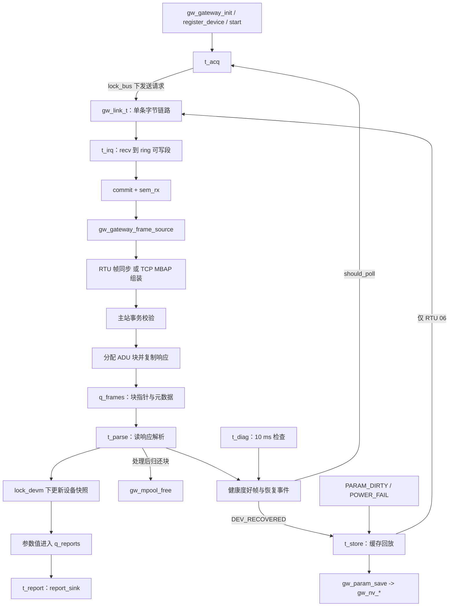

# 架构与实现边界

[返回 README](../README.md) | [构建与测试](BUILD_AND_TEST.md) | [协议与字段](PROTOCOLS.md) | [验证记录](VERIFICATION.md)

本文以当前源码执行路径为准。文件顶部的设计注释、配置项和枚举可能描述目标能力，不自动代表服务已使用或硬件已验证。

## 分层与职责

| 层次 | 源码入口 | 职责 |
| --- | --- | --- |
| 服务编排 | [gw_main.h](../gateway/include/gw_main.h)、[gw_main.c](../gateway/src/gw_main.c) | 初始化、设备注册、线程启动、采集事务、解析和回调出口 |
| 协议与组帧 | [modbus_pdu.c](../gateway/src/modbus_pdu.c)、[modbus_rtu.c](../gateway/src/modbus_rtu.c)、[modbus_tcp.c](../gateway/src/modbus_tcp.c)、[frame_sync.c](../gateway/src/frame_sync.c) | 共用寄存器 PDU、RTU CRC、TCP MBAP、流边界和事务校验 |
| CANopen 独立模块 | [canopen.c](../gateway/src/canopen.c) | COB-ID 分类、NMT 编解码、心跳、对象字典、SDO 辅助函数、PDO 和 EMCY |
| 模型与可靠性 | [device_model.c](../gateway/src/device_model.c)、[bus_health.c](../gateway/src/bus_health.c)、[param_store.c](../gateway/src/param_store.c)、[diag.c](../gateway/src/diag.c) | 设备快照、参数映射、离线缓存、故障策略、参数槽与诊断 |
| 资源基础设施 | [ring_buffer.c](../gateway/src/ring_buffer.c)、[mem_pool.c](../gateway/src/mem_pool.c) | 有界字节缓冲、定长块分配与统计 |
| 平台端口 | [port_rtos.h](../gateway/port/port_rtos.h)、[port_hw.h](../gateway/port/port_hw.h) | 线程/IPC、时间、链路、NV 和硬件故障抽象 |

设备档案是内置示例，不是厂商已验证的驱动。一个 `gw_gateway_t` 只有一个 `link` 和一个全局 `mode`，并非多端口同时运行的 RTU/TCP/CAN 桥接器。

## 当前主路径

1. `gw_gateway_init()` 初始化 ring、模型、健康度、参数槽、IPC 和三个池；根据全局模式只初始化 RTU 或 TCP 主站及对应组帧器。
2. `gw_gateway_start()` 创建六个线程。`t_acq` 每次从轮询游标选择一台获准设备，持有 `lock_bus` 完成一次请求及其重试。它跳过 `GW_PROTO_CANOPEN`，没有按设备协议切换不同总线。
3. 主站配置了外部 `gw_gateway_frame_source()`。该函数消费 `t_irq` 写入的 ring，调用 RTU 帧同步或 TCP 组装器，将完整帧交还事务层；这不是由 `t_parse` 完成的定界。
4. 事务成功后分配 ADU 池块、复制响应并将指针送入 `q_frames`。`t_parse` 解析寄存器、更新快照和健康度、产生上报，最后归还块。
5. `t_report` 调用 `report_sink`；主机示例出口为文本 JSON 行，没有内置云连接、MQTT 或 WebNet。

接收 ring 提供可写段与 `commit` 接口，减少这一接收步骤的中间搬运；后续组帧、响应缓存和 ADU 入池仍存在复制，不能称整条管线零拷贝。

## 线程与同步

数值来自 [gateway_config.h](../gateway/include/gateway_config.h)，RT-Thread 逻辑优先级数值越小越高。

| 线程 | 优先级 | 配置栈 / 字节 | 主要工作与等待点 |
| --- | --- | --- | --- |
| `t_irq` | 4 | 1536 | 链路接收到 ring；单次 `recv` 超时参数为 10 ms |
| `t_acq` | 8 | 6144 | 轮询、组帧、事务重试；有工作后延时 1 ms，无工作后 5 ms |
| `t_parse` | 12 | 5120 | 从 `q_frames` 收取 ADU、快照更新、上报生成；队列等待 100 ms |
| `t_report` | 20 | 4096 | 消费 `q_reports` 并调用 sink；队列等待 100 ms |
| `t_diag` | 24 | 4608 | 栈/看门狗诊断、健康度窗口、故障位和设备心跳检查；延时 10 ms |
| `t_store` | 28 | 3072 | 等待参数变更、掉电、设备恢复事件；事件等待 100 ms |

这些是**配置预算**。主机 pthread 栈另有最低分配与运行库预留，不能据此推导目标 RAM 总量；源码中“已标定”的注释也不是测试报告。尤其 `gw_param_save()` 的两个 2048 字节局部数组已超过 `t_store` 的 3072 字节预算，需要目标侧重新核算。

- `lock_bus` 串行化采集和回放的请求/响应，`lock_devm` 用于解析线程的快照写入；两者请求优先级继承。
- `sem_rx` 通知字节到达；`q_frames` 与 `q_reports` 解耦后续处理；事件组向存储线程传递 `GW_EVT_PARAM_DIRTY`、`GW_EVT_POWER_FAIL`、`GW_EVT_DEV_RECOVERED` 等标志。
- 六个看门狗位对应六线程，超时配置为 2000 ms。主机端口以位集合记录喂狗并触发回调，并不会重置物理 MCU。
- 健康度、统计及部分设备状态由多个线程访问，不能仅凭存在两把互斥锁就认定全工程线程安全；板端接入和压力测试仍需复核共享对象的同步与退出时生命周期。

## 有界资源与所有权

| 资源 | 当前配置 | 实际用途 / 注意事项 |
| --- | --- | --- |
| 原始字节 ring | 2048 字节 | 空满区分留 1 字节，最多存 2047 字节；满载计数 |
| `q_frames` | 48 条 | `gw_raw_frame_t` 描述符携带 ADU 块指针，不在队列中复制整帧 |
| `q_reports` | 32 条 | 定长参数上报；满队列丢弃新报文并计数 |
| `q_store` | 16 条 | 已创建；当前存储路径使用事件组，没有消费此队列 |
| `pool_frame` | 96 块，每块 64 字节 | 已初始化；主路径未使用 |
| `pool_adu` | 24 块，每块 256 字节 | 采集到解析的实际 ADU 存储 |
| `pool_param` | 64 块，每块 32 字节 | 已初始化；当前离线缓存使用模型中的数组 |
| RTU 帧同步缓冲 | 320 字节 | 重同步与候选帧检查 |
| 离线参数写缓存 | 32 条 | 同设备、同寄存器合并，满时返回错误并计数 |
| 设备表 / 事件日志 | 48 项 / 64 条 | 固定容量，不表示已挂载相同数量的真实设备 |

ADU 生命周期：`gw_mpool_alloc()` -> 采集线程填充 -> 入队成功后由解析线程持有 -> `gw_mpool_free()`。队列发送失败时采集线程自行归还，池耗尽则增加 `frame_drops`。停止时没有完整的资源销毁和队列排空接口，不能据短期示例推出反复启停无泄漏。

池存储数组在 `gw_gateway_t` 内部；分配从空闲链头摘取为 O(1)，但释放为检测重复释放遍历空闲链，最坏 O(n)。线程、IPC 和链路端口仍使用 `calloc`、`aligned_alloc` 或 `rt_malloc`，因此只有特定数据通道使用定长池，不是“整个项目无堆”。

**满长 TCP 风险：** `GW_MAX_ADU_TCP=260`，`GW_POOL_ADU_BLOCK=256`；`gw_acq_poll_device()` 的 `memcpy(blk, resp, resp_len)` 没有检查池块容量。模块能构造较长报文不等于整机搬运路径安全；默认示例窗口较小，不能覆盖这一边界。

## 故障策略与接入缺口

[bus_health.c](../gateway/src/bus_health.c) 提供分类与准入策略：

- 连续 CRC 错 5 次、连续非法帧 5 次或连续超时 3 次触发设备隔离；不同类别切换会重置其他连续错误计数。
- 隔离冷却 3000 ms 后 `gw_bus_health_should_poll()` 可放行探测；再次失败刷新冷却时间，连续 3 个好帧恢复设备。
- 错误窗口为 10000 ms，计算 `window_errors * 10000 / window_total`，大于 1000 时进入 DEGRADED；这是定期清零的分段窗口，不是严格滑动窗口。
- 异常响应被分类计数，但不因该类响应触发设备隔离。短路、CAN Bus-Off 或过流可置总线 FAULT，暂停所有轮询。

服务失败时依据主站 `last_attempts` 多次上报健康度，成功时由解析线程报告好帧；这种计数不能简单等同于完整的物理总线错误率。事务重试、帧错误计数、最终失败事务数需要分别解释。

两处闭环未完成：DEGRADED 仅改变状态，没有实际降低轮询频率；总线 FAULT 使 `should_poll()` 对所有设备返回 false，但解除故障又依赖连续好帧，主服务没有专用恢复探测路径。不能保证清掉硬件故障后整机会自行恢复。

配置中 `GW_POLL_PERIOD_MS=20`、`GW_CACHE_FLUSH_PERIOD_MS=100`、`GW_PARAM_SAVE_DEBOUNCE_MS=500` 并未成为对应服务的周期/去抖实现。采集实际上使用上述 1/5 ms 延时；缓存仅在恢复事件后回放，保存事件收到后直接保存。

## 参数模型、缓存与保存

`gw_devm_apply_read()` 保存原始寄存器快照，`gw_devm_read_param()` 按档案类型解释 16/32 位值并计算整数 `raw * scale_num / scale_den`，小数部分会截断。输入寄存器示例表存在，但整机采集当前固定构造 `0x03` 保持寄存器请求，没有采集 `0x04` 输入表的第二条路径。

`gw_devm_write_param()` 的在线分支只返回 `GW_OK`，不会发送真实请求。离线分支可缓存寄存器写入，`gw_store_flush_cache()` 在恢复事件后尝试发送 RTU `0x06`，失败再入队；没有 TCP 回放、周期回放或完整多寄存器参数写入。模型的 `cache_flushed` 记录取出缓存项次数，服务统计的同名字段才记录成功写入次数，二者不可混为一谈。

`gw_param_save()` 写非当前槽，整页回读并比较后才更新 `active_slot` 和序号。两个槽各 2048 字节，头部 16 字节，但代码最大载荷为 2016 字节；精确编码见 [参数槽布局](PROTOCOLS.md#参数槽布局)。

`gw_param_load()` 先在有效槽头中选择最新序号，再校验该槽载荷。若最新槽的头有效而载荷 CRC 错，不会再尝试旧槽，而是返回错误。`gw_gateway_init()` 载入失败后使用默认参数，没有立即调用保存函数。载荷直接复制 C 结构体，没有独立的跨平台序列化与版本迁移实现。

主机 [port_hw_stub.c](../gateway/port/port_hw_stub.c) 以静态内存模拟 NV 和中断写入。掉电桩对整页保存仅写前 8 字节后报错，并非写到一半；进程结束后数据丢失。这能验证一部分软件路径，不能证明真实 Flash 寿命、断电时间预算或跨重启保持。

## 主机与 RT-Thread 两种端口

| 项目 | 主机路径 | RT-Thread 路径 |
| --- | --- | --- |
| 构建入口 | [gateway/Makefile](../gateway/Makefile) | [gateway/SConscript](../gateway/SConscript)，由外部 BSP 引入 |
| RTOS 适配 | [port_host.c](../gateway/port/port_host.c)，pthread/信号量/条件变量 | [port_rtthread.c](../gateway/port/port_rtthread.c)，RT-Thread 线程/IPC |
| 链路与 NV | 硬件桩、loopback、stdio、POSIX socket、内存 NV | RT-Thread 设备和 socket API，需要外部驱动 |
| 应用入口 | [gw_host_sim.c](../gateway/port/gw_host_sim.c) | 仓库没有板级启动应用，需自行接入 |
| 栈观测 | 涂色扫描、入口基线、红区及逻辑预算判断 | 根据当前 SP 估算用量、诊断记录采样峰值，不能替代历史涂色高水位 |

主机默认 `SCHED_OTHER(CFS)`；设置 `GW_RT_SCHED=1` 且进程获准实时调度后才尝试 `SCHED_FIFO` 和 CPU0 亲和性，失败可回退。逻辑优先级继承记账在普通调度下可观察，但不能证明 MCU 实时响应，亦不能将主机耗时直接换算为板端时延。

RT-Thread 移植需先处理：

1. 确认内核/API 版本、BSP 驱动和应用初始化；`SConscript` 仅收集 `src/*.c` 与 `port_rtthread.c`，不包含完整内核或板级工程。
2. 为 `gw_link_rtthread_create()`、`gw_hw_fault_init()` 补齐集成侧声明与调用安排；当前公共硬件头没有它们的声明。工厂的 `cfg` 参数未使用，实际配置要通过后续 `gw_link_open()`。
3. 核对 UART、CAN、Flash、WDT、定时器设备名，替换故障引脚 `0..3` 的占位值。UART 默认为 `9600/8N1`，回调只释放信号量；服务依然启动 `t_irq`。
4. 核对超时单位：时间查询会转为毫秒，但多数 IPC 直接将毫秒值传为 tick，非 `1000 Hz` 内核配置需要换算。
5. 核对 SAL 条件编译、socket 错误语义、消息队列返回语义、CAN 帧字节封装及长度、栈检查接口、WDT 超时单位与 NV 擦除几何。
6. 解决满长 TCP 池容量及存储线程栈预算，并增加目标板压力、故障、掉电与反复启停测试。

这里没有自研板、电路保护或板端 DMA 的交付物。硬件故障枚举只是软件输入接口，不是对应保护电路已设计或已通过试验的证据。
